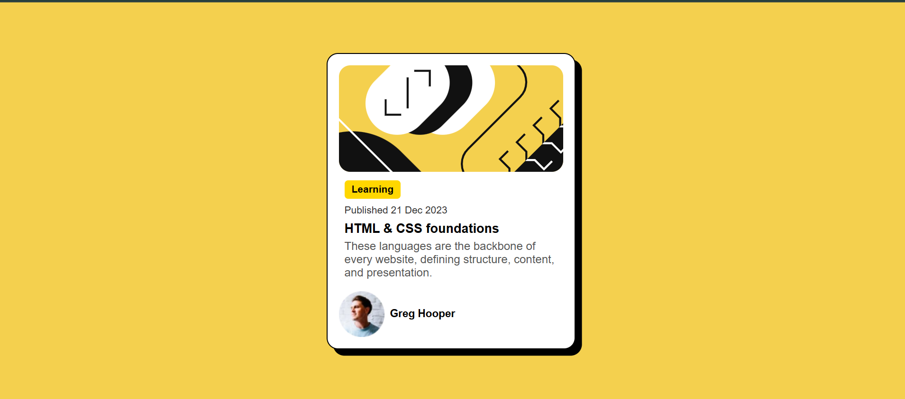

# Frontend Mentor - Blog preview card solution

This is a solution to the [Blog preview card challenge on Frontend Mentor](https://www.frontendmentor.io/challenges/blog-preview-card-ckPaj01IcS). This challenge helped me practice my HTML and CSS skills while building a clean and responsive blog card component. 

## Table of contents

- [Overview](#overview)
  - [The challenge](#the-challenge)
  - [Screenshot](#screenshot)
  - [Links](#links)
- [My process](#my-process)
  - [Built with](#built-with)
  - [What I learned](#what-i-learned)
- [Acknowledgments](#acknowledgments)

## Overview

### The challenge

Users should be able to:

- See hover and focus states for all interactive elements on the page

### Screenshot




### Links

- Solution URL: [View on Frontend Mentor](https://www.frontendmentor.io/solutions/blog-preview-card-using-html-and-css-nTzj5u7NqQ)
- Live Site URL: [View Live Project](https://blog-preview-card-blue-eta.vercel.app/)

## My process

### Built with

- Semantic HTML5 markup
- CSS custom properties
- Flexbox
- Mobile-first workflow

### What I learned

Working on this project helped me better understand Flexbox and how to align items properly. I also practiced using CSS properties like gap to create spacing without relying on extra margins.

Here's an example of a small CSS trick I used:

```css
.description {
    font-size: 16px;
    color: #555;
    margin-bottom: 8px; /* Added spacing below the description tag */ 
}
```
I also learned how to properly structure a simple card layout while keeping it responsive across different screen sizes.

## Acknowledgments

Thanks to the Frontend Mentor community for providing such awesome challenges! This project was a great way to practice writing clean, structured code.