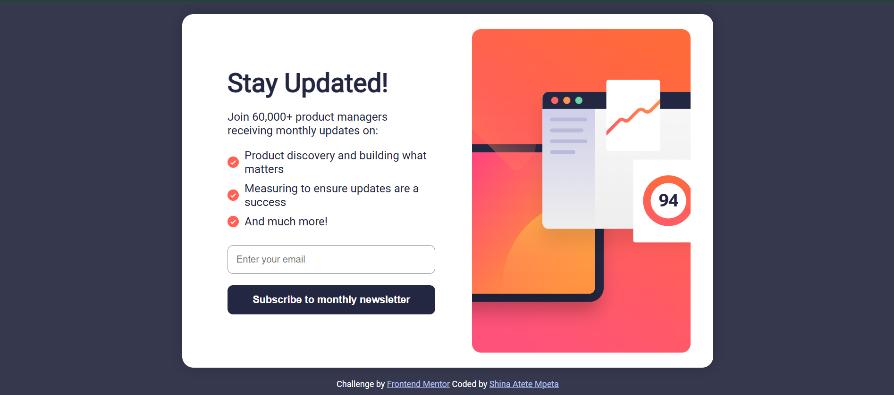

# Frontend Mentor - Newsletter Sign-up Form with Success Message Solution

This is a solution to the [Newsletter sign-up form with success message challenge on Frontend Mentor](https://www.frontendmentor.io/challenges/newsletter-signup-form-with-success-message-3FC1AZbNrv). Frontend Mentor challenges helps you improve your coding skills by building realistic projects.

## Table of contents

- [Overview](#overview)
  - [The Challenge](#the-challenge)
  - [Screenshot](#screenshot)
  - [Links](#links)
- [My Process](#my-process)
  - [Built With](#built-with)
  - [What I Learned](#what-i-learned)
  - [Continued Development](#continued-development)
  - [Useful Resources](#useful-resources)
- [Author](#author)

## Overview

### The Challenge

Users should be able to:

- Add their email and submit the form.
- See a success message with their email after successfully submitting the form.
- See form validation messages if:
  - The field is left empty.
  - The email address is not formatted correctly.
- View the optimal layout for the interface depending on their device's screen size.
- See hover and focus states for all interactive elements on the page.

### Screenshot

### Links

- Solution URL: [Frontend mentor solution URL](https://www.frontendmentor.io/solutions/newsletter-sign-up-form-with-success-message-vii4gMgEEf)
- Live Site URL: [netlfiy live site URL](https://delicate-druid-8d9ecc.netlify.app/)

## My Process

### Built With

- Semantic HTML5 markup
- CSS custom properties
- Flexbox
- CSS Grid
- Mobile-first workflow

### What I Learned

Working on this challenge improved my understanding of form validation, responsive design, and user experience. I reinforced my skills in creating accessible forms and handling user input gracefully.

##

Thank you for checking out my solution! Feel free to give me feedback or suggestions. 😊
